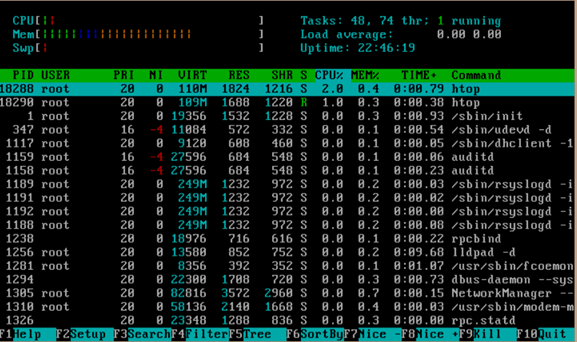
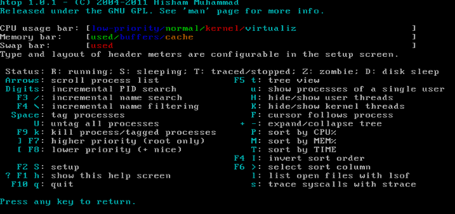
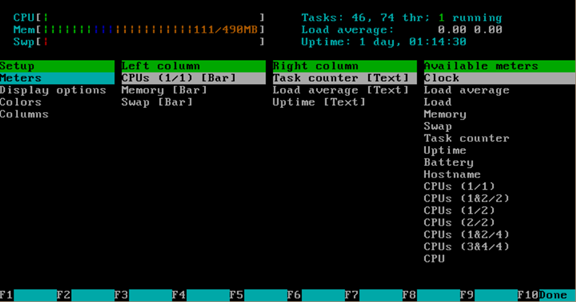
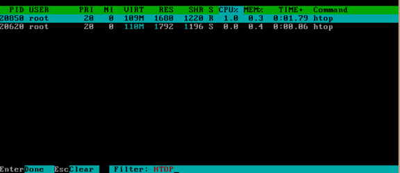

# htop

htop是Linux系统下一个基本文本模式的、交互式的进程查看器，主要用于控制台或shell中，可以替代top，或者说是top的高级版。  

#### htop命令优点:

       1) 快速查看关键性能统计数据，如CPU（多核布局）、内存/交换使用；
       2) 可以横向或纵向滚动浏览进程列表，以查看所有的进程和完整的命令行；
       3) 杀掉进程时可以直接选择而不需要输入进程号；
       4) 通过鼠标操作条目；
       5) 比top启动得更快；

#### htop常用功能键  

F1 : 查看htop使用说明        
F2 : 设置        
F3 : 搜索进程      
F4 : 过滤器，按关键字搜索      
F5 : 显示树形结构    
F6 : 选择排序方式          
F7 : 减少nice值，这样就可以提高对应进程的优先级          
F8 : 增加nice值，这样可以降低对应进程的优先级        
F9 : 杀掉选中的进程        
F10 : 退出htop        
/ : 搜索字符      
l ：显示进程打开的文件: 如果安装了lsof，按此键可以显示进程所打开的文件  
u ：显示所有用户，并可以选择某一特定用户的进程      
s : 将调用strace追踪进程的系统调用        
t : 显示树形结构        
H ：显示/隐藏用户线程      
I ：倒转排序顺序      
K ：显示/隐藏内核线程          
M ：按内存占用排序      
P ：按CPU排序          
T ：按运行时间排序        
上下键或PgUP, PgDn : 移动选中进程      
左右键或Home, End : 移动列表      
Space(空格) : 标记/取消标记一个进程。
命令可以作用于多个进程，例如 "kill"，将应用于所有已标记的进程

#### htop使用

命令行直接输入htop, 出现htop的界面  
  

各项从上至下分别说明如下：  
  
左边部分从上至下，分别为，cpu、内存、交换分区的使用情况，右边部分为：Tasks为进程总数，当前运行的进程数、Load average为系统1分钟，5分钟，10分钟的平均负载情况、Uptime为系统运行的时间。 

  
以上各项分别为：

* PID：进行的标识号
* USER：运行此进程的用户
* PRI：进程的优先级
* NI：进程的优先级别值，默认的为0，可以进行调整
* VIRT：进程占用的虚拟内存值
* RES：进程占用的物理内存值
* SHR：进程占用的共享内存值
* S：进程的运行状况，R表示正在运行、S表示休眠，等待唤醒、Z表示僵死状态
* %CPU：该进程占用的CPU使用率
* %MEM：该进程占用的物理内存和总内存的百分比
* TIME+：该进程启动后占用的总的CPU时间
* COMMAND：进程启动的启动命令名称  

  

F1: 显示帮助信息  

F2: htop设定  

鼠标点击Setup或者按下F2 之后进入htop 设定的页面  

  

Setup 选项下的：

1 Meters

设定顶端的 显示信息，分为左右两侧，Left column 表示左侧的显示的信息，Right column表示右侧显示的信息，如果要新加选项，可以选择Available meters添加，F5新增到上方左侧，F6新增到上方右侧。Left column和Right column下面的选项，可以选定信息的显示方式，有LED、Bar(进度条)、Text(文本模式)，可以根据个人喜好进行设置  

2 Display options  

  

选择要显示的内容，按空格 x表示显示，选择完后，按F10保存  

3 Colors  

  

设定界面以什么颜色来显示，个人认为用处不大，各人喜好不同，假如我们选择Black on White后显示效果如下

  

4 Colums  

  

作用是增加或取消要显示的各项内容，选择后F7(向上移动)、F8(向下移动)、F9(取消显示、F10(保存更改))此处增加了PPID、PGRP，根据各人需求，显示那些信息。  

F3: 搜索进程  

在界面下按F3或直接输入”/”就可以直接进入搜索模式，是按照进程名进行搜索的。例如  

  

F4: 过滤器  

相当于模糊查找，不区分大小写，下方输入要搜索的内容后，则界面只显示搜索到的内容，更加方便查看，例如：  

  

F5: 以树形显示  

  

F6: 排序方式  

  

按下F6后会跳转至上图界面，让您选择以什么方式进行排序,在Sort by下选择您要以什么来排序  

F7,F8：调整进程nice值

F7表示减小nice值(增大优先级),F8增大nice值(减小优先级)，选择某一进程，按F7或F8来增大或减小nice值，nice值范围为-20-19，此处我把apache的nice值调整到了19  

  

F9：杀死进程

选择某一进程按F9即可杀死此进程，很方便

F10:退出htop
